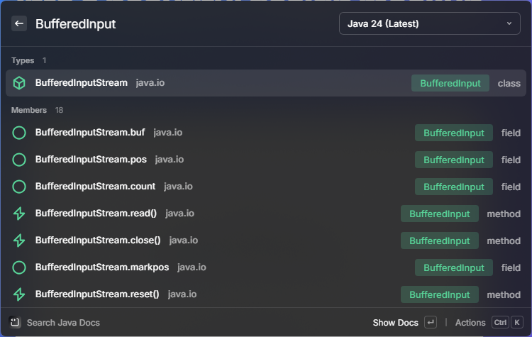
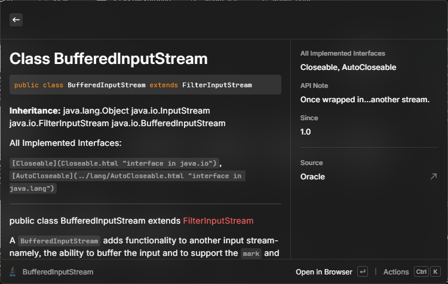
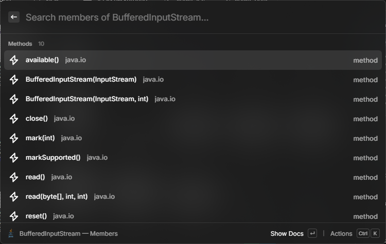

# Dev Docs

A Raycast extension for fast, offline-friendly access to developer API documentation. Fuzzy-search the Java SE API (versions 11, 17, 21, 24) straight from Raycast, read rendered pages inline, and jump to live Oracle docs when you need more.


---

## Screenshots

Screenshots live under `metadata/`. Raycast picks these up for the Store listing.

| Search | Detail View | Members Browser |
| --- | --- | --- |
|  |  |  |

---

## Features

- Fuzzy search across Java SE classes, interfaces, methods, fields, and packages.
- Version dropdown inside the search bar for switching between Java 11, 17, 21, and 24 on the fly.
- Last-used version is remembered via `LocalStorage` and restored on the next launch.
- Rendered Markdown Detail view with a metadata sidebar (Module, Package, Since, Deprecated, Superclass, Interfaces).
- "Browse Members" mode drills into a class and lets you fuzzy-search its methods and fields without reloading the page.
- One-keystroke actions for opening the live Oracle page, copying the URL, or copying the fully-qualified name.
- Disk-backed index and page cache under Raycast's `environment.supportPath`, with an LRU eviction policy bounded by a configurable MB budget.
- Provider abstraction (`DocProvider`) so new languages and doc sources can be added as additional commands that reuse the same UI.

---

## Commands

| Name | Description | Default Shortcut |
| --- | --- | --- |
| Search Java Docs | Fuzzy-search the Java SE API for the selected version and preview pages inline. | Configurable in Raycast |

---

## Preferences

Configure these under Raycast Settings -> Extensions -> Dev Docs.

| Preference | Type | Default | Description |
| --- | --- | --- | --- |
| Default Java Version | Dropdown | `21` | Version used when no previous selection has been stored. Options: `11`, `17`, `21`, `24`. |
| Page Cache Limit (MB) | Number | `50` | Maximum size of the on-disk rendered-page cache. Oldest entries are evicted first (LRU). |

---

## Keyboard Shortcuts

Shortcuts available from the search list and Detail view.

| Shortcut | Action | Context |
| --- | --- | --- |
| Enter | Show Docs (rendered Detail view) | Search list |
| Ctrl + Enter | Open in Browser (live Oracle page) | Search list / Detail |
| Ctrl + M | Browse Members (methods and fields) | Search list (class entries) |
| Cmd + Shift + . | Copy URL / Copy FQN | Action Panel everywhere |

---

## How It Works

The extension is split into three layers: a provider, a cache, and the Raycast UI.

1. **Index.** On first launch for a given version, the provider fetches Oracle's `type-search-index.js`, `member-search-index.js`, `package-search-index.js`, and `tag-search-index.js`, normalises them into a compact in-memory structure, and writes a serialised snapshot to disk. Subsequent launches load the snapshot directly.
2. **Scorer.** A small fuzzy matcher ranks entries against the query using a combination of prefix match, camel-hump match, and substring fallback. Results are capped and streamed to Raycast's list.
3. **HTML parser.** When the user opens a page, the raw HTML is fetched, stripped of navigation chrome, and converted to Markdown. Metadata (Module, Package, Since, Deprecated) is pulled out separately and rendered in the Detail sidebar.
4. **Disk cache.** Both indexes and rendered pages are persisted under `environment.supportPath`. Pages are tracked in an LRU manifest; when the total size exceeds the configured budget, the least-recently-accessed entries are dropped.
5. **Provider abstraction.** Every doc source implements a common `DocProvider` contract, so adding MDN, Python, or Rust only requires a new provider module and a new command entry in `package.json`.

### Folder Layout

```
src/
  commands/
    search-java.tsx          # Entry point for the "Search Java Docs" command
  providers/
    types.ts                 # DocProvider interface + shared types
    java/
      index.ts               # Java provider implementation
      fetcher.ts             # Oracle index + page fetch
      parser.ts              # HTML -> Markdown + metadata extraction
  ui/
    SearchList.tsx           # Shared fuzzy-search list view
    DocDetail.tsx            # Shared Markdown detail view with sidebar
    MembersList.tsx          # Shared members browser
  cache/
    indexCache.ts            # On-disk index snapshots
    pageCache.ts             # LRU page cache with MB budget
  lib/
    scorer.ts                # Fuzzy scorer
    storage.ts               # LocalStorage helpers (last-used version, etc.)
package.json                 # Raycast manifest: commands, preferences
metadata/                    # Store screenshots
```

---

## Adding a New Provider

The provider abstraction is designed to make new doc sources cheap to add. To wire up, for example, a Python docs provider:

1. **Implement the contract.** Create `src/providers/python/index.ts` and export an object that satisfies the `DocProvider` interface declared in `src/providers/types.ts`. At minimum you need: `id`, `versions`, `loadIndex(version)`, `search(query, version)`, `fetchPage(entry)`, and `resolveUrl(entry)`.
2. **Hook up fetching and parsing.** Put network calls in a `fetcher.ts` and HTML/RST/JSON normalisation in a `parser.ts` under the same folder. Reuse `cache/indexCache.ts` and `cache/pageCache.ts` for persistence - they are provider-agnostic as long as you pass a unique `providerId`.
3. **Add a command.** Create `src/commands/search-python.tsx` that instantiates `SearchList` with your new provider. The list, detail, and members UI all accept any `DocProvider`, so no UI code needs to be duplicated.
4. **Register in the manifest.** Add a new entry to the `commands` array in `package.json` (name, title, subtitle, mode: `view`) and, if the provider exposes versions, add a preference for the default version.

That's the full surface area - no changes required to the search list, scorer, Detail view, or cache.

---

## Development

Prerequisites: Node.js 18+, Raycast, and a Raycast developer account.

```bash
git clone https://github.com/abh80/raycast-extension-java-doc.git
cd raycast-extension-java-doc
npm install
```

Run the extension in Raycast's development mode. This hot-reloads on save and registers the commands in your local Raycast:

```bash
npm run dev
```

Lint:

```bash
npm run lint
```

Production build (type-check + bundle):

```bash
npm run build
```

During development, the local support path (where indexes and pages are cached) is printed to the console on first run. Deleting that directory forces a full re-index.

---

## Publishing

Submitting to the Raycast Store is a single command. It runs the build, validates the manifest, and opens a pull request against the `raycast/extensions` repository:

```bash
npm run publish
```

Make sure `metadata/` contains up-to-date screenshots and that the version in `package.json` has been bumped before publishing.

---

## Credits and Disclaimer

- Java SE API documentation is owned by Oracle Corporation. This extension does not redistribute Oracle's documentation; it fetches publicly available pages on demand and caches them locally for personal, interactive use only.
- All trademarks (Java, Oracle) are the property of their respective owners.
- This project is not affiliated with, endorsed by, or sponsored by Oracle Corporation or Raycast Technologies Ltd.

If you are an IP holder and would like the extension adjusted, please open an issue on the repository.

---

## License

MIT. See `LICENSE` for the full text.

Copyright (c) 2026 abh80.
